```mermaid
flowchart LR
    %% Training
    B4[Start] --> C[Training Module YOLOv8m]
    C --> C1[Load Pretrained Weights COCO]
    C1 --> C2[Fine-tune on 9000 Images]
    C2 --> C3[Validate on 1000 Images]
    C3 --> C4[Save Best Model best.pt]

    %% Inference
    C4 --> D[Robust Inference Module]
    D --> D1[Load Test Image]

    %% TTA Branches
    D1 --> E1[View 1 Original]
    D1 --> E2[View 2 Horizontal Flip]
    D1 --> E3[View 3 Vertical Flip]

    %% Detection
    E1 --> F1[Detect and Count]
    E2 --> F2[Detect and Count]
    E3 --> F3[Detect and Count]

    %% Post Processing
    F1 --> G[Post Processing]
    F2 --> G
    F3 --> G

    G --> G1[Apply Adaptive Thresholds]
    G1 --> G2[Logic Constraint Max 4]
    G2 --> H[Median Aggregation]

    %% Output
    H --> I[Final Count Calculation]
    I --> J[Submission CSV]
    J --> K[Perfect Score 1.0]

    %% Styling
    style C fill:#1e293b,stroke:#38bdf8,stroke-width:2px,color:#ffffff
    style D fill:#1e293b,stroke:#4ade80,stroke-width:2px,color:#ffffff
    style K fill:#fbbf24,stroke:#f59e0b,stroke-width:2px,color:#000000
```

# SOLIDWORKS-AI-Hackathon
SOLIDWORKS AI Hackathon, hosted at IIT Madras Mission in this competition is to build a machine learning model that can correctly identify which mechanical parts appear in a synthetic image.

---

## 🎭 Model Architecture

The final solution is a **modular YOLOv8m-based counting system** with **test-time augmentation (TTA)** and **median aggregation**, specifically designed to achieve robust, integer‑accurate counts under the exact‑match metric.

### 🔹 Evolution of Architectures

1. **ResNet50 Regression**
   - Image → ResNet50 → FC(4) → continuous counts → rounded to integers  
   - Score: **0.9750**  
   - Issue: No localization; struggled with overlapping parts and dense scenes.[conversation_history:1]

2. **ResNet50 Multi‑Head Classification**
   - Shared backbone: ResNet50 (FC removed)  
   - Four independent heads (bolt, pin, nut, washer), each classifying count ∈ {0,…,4}  
   - Score: **0.9921**  
   - Issue: Still blind to spatial structure; confusion in overlapping objects.[conversation_history:1]

3. **YOLOv8m – Base Detector**
   - Standard object detection: Image → YOLOv8m → detections → count per class  
   - Training: 20 epochs, batch 16, image size 640, NVIDIA P100 GPU.[conversation_history:1]  
   - Score: **0.9986**  
   - Breakthrough: Explicit localization solved most errors.

4. **YOLOv8m + naïve TTA**
   - Used `augment=True`, `conf=0.2`, `iou=0.6` directly in Ultralytics inference.  
   - Score dropped to **0.9929** due to extra false positives (“ghost” parts) from aggressive augmentation.[conversation_history:1]

5. **YOLOv8m + Median Voting (Final)**
   - Custom TTA + median aggregation + class‑wise thresholds + domain logic.  
   - Score: **1.0000** – **perfect exact‑match accuracy** on leaderboard.[conversation_history:1]

---

## 🧱 Final Model Design

### 1️⃣ Backbone: YOLOv8m

- **Task:** Detection (`task=detect`)  
- **Hyperparameters (key):**
  - `epochs=20`, `batch=16`, `imgsz=640`
  - `lr0=0.01`, `momentum=0.937`, `weight_decay=0.0005`
  - `hsv_s=0.7`, `hsv_v=0.4`, `mosaic=1.0`, `fliplr=0.5`[conversation_history:1]  
- Trained on `yolov8m.pt` pretrained weights with full box + class supervision.

### 2️⃣ Robust Inference: TTA + Median Aggregation

For each test image:

1. **Generate 3 Views**
   - Original image  
   - Horizontal flip (`cv2.flip(img, 1)`)  
   - Vertical flip (`cv2.flip(img, 0)`)

2. **Per‑View Detection**
   - Run YOLOv8m independently on each view (`iou=0.6`, default NMS).
   - Apply **per‑class confidence thresholds** (tuned via error analysis):
     - `bolt`: **0.50** – precise, avoids elongated artifacts  
     - `locatingpin`: **0.35** – intermediate threshold  
     - `nut`: **0.35** – intermediate threshold  
     - `washer`: **0.15** – permissive to recover low‑contrast thin washers[conversation_history:1]

3. **Per‑View Logic Constraint**
   - Enforce **maximum of 4** per part type, based on dataset statistics:  
     `count[class] = min(count[class], 4)`.[conversation_history:1]

4. **Median Voting Across Views**
   - For each class, collect 3 counts `[c₁, c₂, c₃]` from the three views.  
   - Final count = `median(c₁, c₂, c₃)` (integer).  
   - Rationale:
     - **Mean** is sensitive to outliers (one over‑detection inflates result).  
     - **Max** is optimistic and tends to over‑count.  
     - **Median** serves as a **majority vote** for discrete counts; robust to one bad view.

> “With three augmented views, median aggregation acts as a majority‑vote mechanism for counts, improving robustness without introducing over‑count bias.”[conversation_history:1]

---

## 📏 Evaluation

### Metric: Exact‑Match Accuracy

For each image, the model outputs four integers:

\[
($\hat{b}$, $\hat{p}$, $\hat{n}$, $\hat{w}$)
\]

The prediction is **correct** only if:

\[
($\hat{b}$, $\hat{p}$, $\hat{n}$, $\hat{w}$) = (b, p, n, w)
\]

Final score = (#exactly correct images) / (total test images).

- ResNet Regression: **0.9750**  
- ResNet Multi‑Head: **0.9921**  
- YOLOv8m Base: **0.9986**  
- YOLOv8m + naïve TTA: **0.9929**  
- **YOLOv8m + Median Voting: 1.0000 (Perfect)**

---

## 🔄 Workflow

#### 1️⃣ Data Preparation
1. **Load Raw Annotations:** Read `train_bboxes.csv` containing image names, class labels, and bounding box coordinates (`x_min`, `y_min`, `x_max`, `y_max`).
2. **Convert Format:** Transform box coordinates into YOLO format: `(x_center, y_center, width, height)` normalized to [0, 1].
3. **Generate Labels:** Create individual `.txt` label files for each training image.
4. **Split Dataset:** Partition images into **90% Training** and **10% Validation** sets.

#### 2️⃣ Training (YOLOv8m)
1. **Load Pretrained Weights:** Initialize `yolov8m.pt` (COCO-pretrained).
2. **Configure Training:**
   - **Epochs:** 20
   - **Batch Size:** 16
   - **Image Size:** 640×640
   - **Optimizer:** Auto (AdamW)
   - **Learning Rate:** 0.01 (initial)
3. **Train Model:** Execute training on GPU (e.g., NVIDIA P100).
4. **Save Best Model:** Store the weights (`best.pt`) with the highest validation mAP.

#### 3️⃣ Robust Inference (TTA + Median Voting)
1. **Load Test Images:** Iterate through the unlabeled test dataset.
2. **Generate Views (TTA):** For each image, create 3 versions:
   - Original
   - Horizontal Flip
   - Vertical Flip
3. **Run Parallel Inference:**
   - Detect objects in all 3 views using the trained YOLOv8m model.
   - Apply **Adaptive Thresholds**:
     - Bolt: 0.50
     - Washer: 0.15
     - Nut/Pin: 0.35
4. **Apply Logic Constraints:** Clip counts for each class to a maximum of 4.
5. **Aggregate Votes:** Calculate the **median** count across the 3 views for each class to determine the final prediction.
6. **Generate Submission:** Save the final counts to `submission.csv` in the required format.

---

## ➡️ Flowchart
```md


---

## 🌐 Features

Key characteristics of the solution:

- **Bounding‑Box–Aware Training:** Uses full box supervision for high‑precision localization.
- **Model‑Agnostic Dataset Pipeline:** CSV → YOLO format is implemented generically, so any YOLO variant (v8, v9, v10) can be swapped in.
- **Flexible Inference Modes:**
  - Standard single‑pass YOLO inference (fast, near‑perfect).  
  - Custom TTA + Median Voting (slower but maximally robust).
- **Domain Constraints:** Hard caps on maximum counts per class (≤4) remove impossible predictions.
- **Research‑Grade Error Analysis:** Per‑class thresholds and median aggregation were derived through manual inspection of failure modes, not blind grid search.[conversation_history:1]

---

## 🔧 Usage

### 🔹 Installation
Install the library:
<br>
`!pip install ultralytics -q`

### 🔹 Data Preprocessing
For preparing features and scaling:
<br>
`solid-3-yolo-dataset-preparation.ipynb`

### 🔹 Training
Run the training notebook:
<br>
`solid-3-yolo-training.ipynb`

### 🔹 Inference / Submission
To generate predictions and submission file:
<br>
`solid-3-yolo-inference-submission_4.ipynb`

---

## 📊 Results

**Benchmark Performance:**

- **Metric:** Exact-Match Accuracy (0/1 Loss)
- **Final Score:** **1.0000** (2000/2000 Images Correct)

**Key Insights:**
- **Localization is King:** Object detection vastly outperformed regression.
- **Robustness > Speed:** 3x inference time was a worthy trade-off for perfect accuracy.
- **Domain Logic:** Simple physics constraints (Max 4 parts) prevented hallucinations.

---

## 🎯 Real-World Impact
This project demonstrates how **Robust Statistics** combined with **Deep Learning** can solve high-precision industrial inspection tasks.
- **Quality Control:** Automated counting of parts in assembly lines.
- **Inventory Management:** Precise stock auditing from visual feeds.
- **Reliability:** The median-voting mechanism ensures the system is resilient to camera noise and occlusions.

---

## 📚 References
- [YOLOv8 Documentation](https://docs.ultralytics.com/)
- [SOLIDWORKS AI Hackathon](https://unstop.com/hackathons/solidworks-ai-hackathon-iit-madras-1602627)
- [OpenCV Flip Documentation](https://docs.opencv.org/4.x/d2/de8/group__core__array.html#gaca7be533e3dac7feb70fc60635adf441)


---

## 👨‍💼 Author
Developed by [Priyansh Keshari](https://github.com/priyanshkeshari) as part of the SOLIDWORKS AI Hackathon by IIT Madras.
